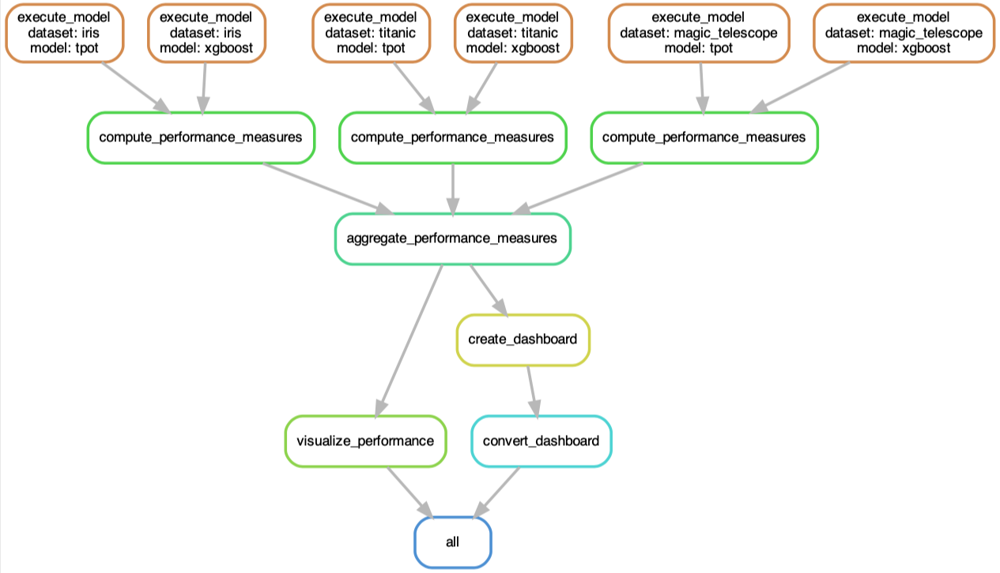
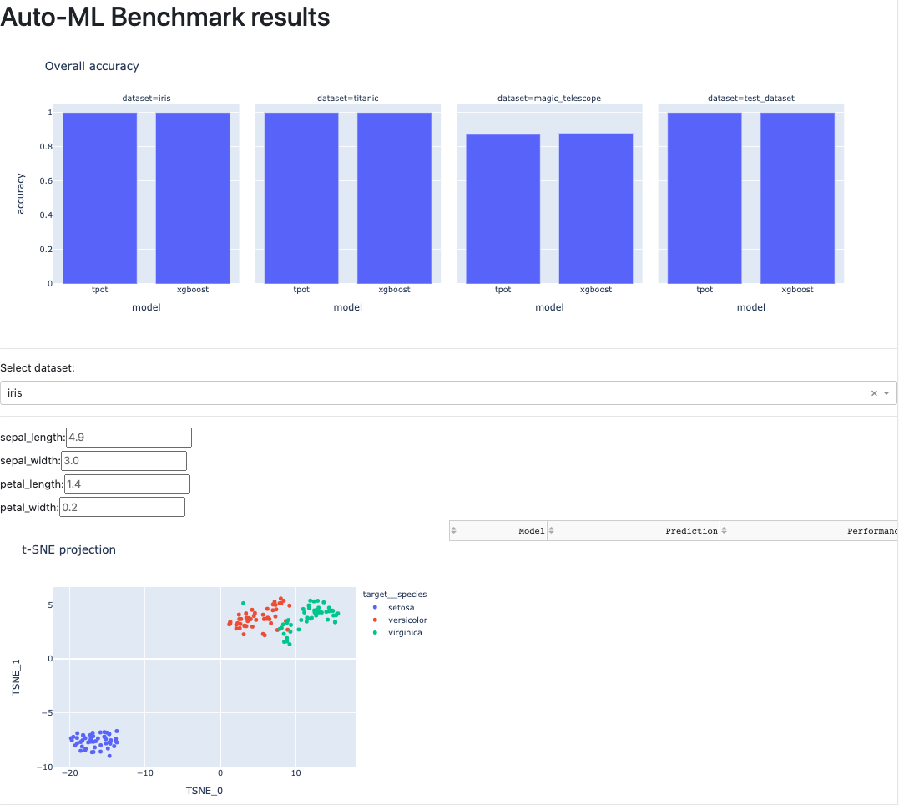

# The Big Auto-ML Showdown


Automated Pipeline                         |  Interactive Dashboard
:-----------------------------------------:|:-------------------------:
  |  


Machine learning methods are often seen as black boxes which are difficult to understand.
Automated machine learning frameworks tend to take these boxes, put them into a dark room, lock the door, and run away (watch out for sarcasm!).
So instead of improving interpretability directly, let's conduct a benchmark in a meaningful way in order to learn more about them.

There have been some approaches in this direction already. See, e.g., the [AutoML Benchmark](https://openml.github.io/automlbenchmark/), the work of [STATWORX](https://www.statworx.com/at/blog/a-performance-benchmark-of-different-automl-frameworks/), and the benchmark accompanying the [Auto-Sklearn](https://arxiv.org/abs/2007.04074) publication.
However, they are all lacking with regards to the underlying pipeline system using to setup the benchmark, as well as the exploration capabilities of the results.

Here, we build a sustainable (i.e. reproducible, adaptable, and transparent) workflow to automatically benchmark a multitude of models against a diverse set of data.
The models are existing auto-ML frameworks which each have their own advantages and disadvantages related to ease-of-use, execution speed, and predictive performance. All of these features will become apparent in this benchmark.
The datasets try to be as representative as possible and cover a wide range of applications. They thus serve as a reasonable playground for the aforementioned models.
Finally, the results are displayed in an interactive dashboard which allows an in-depth exploration of the generated performance evaluation.

Check out the [screencast](https://www.youtube.com/watch?v=gecxYwFtX24) (for LauzHack2020).

## Resources

### Models

* [XGBoost](https://github.com/dmlc/xgboost): optimized distributed gradient boosting (this will serve as baseline to calibrate the results)
* [auto-sklearn](https://github.com/automl/auto-sklearn): "extend Auto-sklearn with a new, simpler meta-learning technique"
* [PyCaret](https://github.com/pycaret/pycaret): "end-to-end machine learning and model management tool"
* [TPOT](https://github.com/EpistasisLab/tpot): "optimizes machine learning pipelines using genetic programming"

### Datasets

* `test_dataset`: just a dummy dataset to make sure everything works
* `iris`: classic and very easy multi-class classification dataset
* `titanic`: another classic survival dataset
* `MAGIC Gamma Telescope`: [classification](https://archive.ics.uci.edu/ml/datasets/MAGIC+Gamma+Telescope) of high energy gamma particles

## Usage

Execute the following command to run all models on all datasets:
```bash
$ snakemake -j 1 -pr --use-conda
```

Afterwards, execute `python results/dashboard.py` to enter an interactive dashboard for exploring the results.

### Adding new datasets

To add a new dataset, you simply need to add a single CSV file to `./resources/datasets/{dataset}.csv`.
Each response variable/column needs to be prefixed with `target__` (and there has to be exactly one). All other columns are treated as covariates.

### Adding new models

A new model can be added by implementing its training procedure and putting the script into `./resources/models/{model}.py`. Each script consists of a single `main` function which takes `X_train` and `y_train` as input.
